# Diagrama de Clases — Visión Electoral

Diagrama de clases del sistema completo: backend (MongoDB), mobile (SQLite/Room) y los DTOs que viajan en el contrato `POST /api/surveys/sync`. Deriva del esquema documentado en [`../database/schema.md`](../database/schema.md) — si uno cambia, el otro también.

> Renderiza nativo en GitHub. Si lo abres en otro visor sin soporte Mermaid, copia el bloque `mermaid` a [mermaid.live](https://mermaid.live).

```mermaid
---
title: Visión Electoral — Diagrama de clases (backend + mobile)
---
classDiagram
    direction LR

    %% ============================================================
    %% ENUMS
    %% ============================================================
    class UserRole {
        <<enumeration>>
        encuestador
        analista
        administrador
    }

    class TemplateStatus {
        <<enumeration>>
        borrador
        publicada
        archivada
    }

    class QuestionType {
        <<enumeration>>
        abierta
        cerrada
    }

    class SyncStatus {
        <<enumeration>>
        pendiente
        sincronizado
    }

    %% ============================================================
    %% BACKEND — MongoDB Atlas
    %% ============================================================
    class User {
        +ObjectId _id
        +string firebase_uid  «unique»
        +string email  «unique»
        +string name
        +UserRole role
        +ObjectId? zone_id
        +Date created_at
        +Date updated_at
        +isEncuestador() boolean
        +isAnalista() boolean
        +isAdministrador() boolean
        +canEditTemplate() boolean
        +canViewIndividualResponses() boolean
        +assignZone(zoneId: ObjectId) void
        +updateProfile(name: string) void
        +touchUpdatedAt() void
    }
    note for User "Índices: firebase_uid (único), email (único), role.\nzone_id solo se asigna a encuestadores."

    class Zone {
        +ObjectId _id
        +string name  «unique»
        +Date created_at
        +rename(name: string) void
        +hasUsers() boolean
        +listSurveyors() User[]
    }

    class SurveyTemplate {
        +ObjectId _id
        +string name
        +string? description
        +TemplateStatus status
        +Question[] questions
        +ObjectId created_by
        +Date? published_at
        +Date? archived_at
        +Date created_at
        +Date updated_at
        +addQuestion(q: Question) void
        +removeQuestion(questionId: string) void
        +updateQuestion(questionId: string, data: Question) void
        +reorderQuestions(order: string[]) void
        +findQuestion(questionId: string) Question
        +publish() void
        +archive() void
        +duplicate() SurveyTemplate
        +isEditable() boolean
        +isPublished() boolean
        +validateAnswers(answers: Answer[]) boolean
    }
    note for SurveyTemplate "Índice: status.\nPublicada con respuestas → NO editable\n(409 Conflict; duplicar en su lugar)."

    class Question {
        <<embedded>>
        +string question_id  «UUID estable»
        +number order
        +string text
        +QuestionType type
        +boolean required
        +boolean multiple
        +Option[]? options
        +isOpen() boolean
        +isClosed() boolean
        +isRequired() boolean
        +allowsMultiple() boolean
        +addOption(opt: Option) void
        +removeOption(optionId: string) void
        +findOption(optionId: string) Option
        +rename(text: string) void
    }
    note for Question "options solo cuando type = cerrada.\nquestion_id sobrevive a renombrados de text."

    class Option {
        <<embedded>>
        +string option_id  «UUID»
        +string text
        +rename(text: string) void
        +equals(other: Option) boolean
    }

    class SurveyResponse {
        +ObjectId _id
        +string submission_id  «UUID v4, único»
        +ObjectId template_id
        +ObjectId surveyor_id
        +ObjectId zone_id
        +Answer[] answers
        +Date captured_at
        +Date synced_at
        +getAnswerFor(questionId: string) Answer
        +hasAnswerFor(questionId: string) boolean
        +validateAgainst(template: SurveyTemplate) boolean
        +hashAnswers() string
        +equalsPayload(input: SyncResponseInput) boolean
        +isAnonymous() boolean
    }
    note for SurveyResponse "Respuesta ANÓNIMA: sin PII del encuestado.\nÍndices: submission_id (único, idempotencia),\n{zone_id, captured_at desc},\n{surveyor_id, captured_at desc},\n{template_id, captured_at desc}."

    class Answer {
        <<embedded>>
        +string question_id
        +string? value
        +string[]? selected_option_ids
        +isOpen() boolean
        +isClosed() boolean
        +isEmpty() boolean
        +matches(question: Question) boolean
    }
    note for Answer "Si pregunta = abierta → value.\nSi pregunta = cerrada → selected_option_ids\n(1 = única; N = múltiple)."

    %% ============================================================
    %% MOBILE — SQLite / Room
    %% ============================================================
    class TemplateCache {
        <<mobile / SQLite>>
        +string template_id  «PK»
        +string name
        +string status
        +string questions_json
        +long updated_at
        +save(template: SurveyTemplate) void
        +load(templateId: string) TemplateCache
        +invalidate() void
        +isStale(now: long) boolean
        +toSurveyTemplate() SurveyTemplate
        +parseQuestions() Question[]
    }

    class ResponseQueue {
        <<mobile / SQLite>>
        +string submission_id  «PK, UUID v4»
        +string template_id
        +string zone_id
        +string surveyor_uid
        +string answers_json
        +long captured_at
        +SyncStatus synced
        +int sync_attempts
        +string? last_error
        +long? server_synced_at
        +enqueue(response: SurveyResponse) void
        +getPending() ResponseQueue[]
        +markSynced(submissionId: string) void
        +markRejected(submissionId: string, reason: string) void
        +incrementAttempts() void
        +purgeOldSynced(days: int) void
        +toSyncInput() SyncResponseInput
        +parseAnswers() Answer[]
    }
    note for ResponseQueue "Cola offline-first.\nsynced y jwt_token NO viajan al servidor.\nLimpieza: borrar filas con synced=1 tras 7 días."

    class Session {
        <<mobile / SQLite, single-row>>
        +string uid  «PK»
        +string email
        +string name
        +string role
        +string jwt_token
        +string zone_id
        +login(user: User, token: string) void
        +logout() void
        +isAuthenticated() boolean
        +getToken() string
        +getCurrentUser() User
        +refreshToken(token: string) void
        +hasRole(role: UserRole) boolean
    }

    %% ============================================================
    %% CONTRATO DE SINCRONIZACIÓN
    %% ============================================================
    class SyncRequest {
        <<DTO · POST /api/surveys/sync>>
        +SyncResponseInput[] body  «1..200»
        +validate() boolean
        +size() int
        +toJson() string
        +fromQueue(items: ResponseQueue[]) SyncRequest
    }

    class SyncResponseInput {
        <<DTO>>
        +string submission_id  «UUID»
        +string template_id
        +string surveyor_uid
        +string zone_id
        +string captured_at  «ISO datetime»
        +AnswerInput[] answers  «min 1»
        +validate() boolean
        +toEntity() SurveyResponse
        +matchesJwt(firebaseUid: string) boolean
    }

    class AnswerInput {
        <<DTO>>
        +string question_id
        +string? value  «max 2000»
        +string[]? selected_option_ids
        +isOpen() boolean
        +isClosed() boolean
        +toAnswer() Answer
        +validate() boolean
    }

    class SyncResult {
        <<DTO · respuesta del servidor>>
        +string[] accepted
        +string[] duplicated
        +RejectedItem[] rejected
        +isAccepted(submissionId: string) boolean
        +isDuplicated(submissionId: string) boolean
        +isRejected(submissionId: string) boolean
        +getReason(submissionId: string) string
        +totalProcessed() int
        +merge(other: SyncResult) SyncResult
    }

    class RejectedItem {
        <<DTO>>
        +string submission_id
        +string reason
        +getReason() string
        +isRetryable() boolean
    }
    note for SyncResult "Idempotencia por submission_id único.\ninsertMany(ordered:false); E11000 → duplicated."

    %% ============================================================
    %% REGLAS DE VALIDACIÓN (referencia)
    %% ============================================================
    class ValidationRules {
        <<rules>>
        +R1 answer.question_id ∈ template.questions
        +R2 cerrada → selected_option_ids ⊂ options; value vacío
        +R3 abierta → value presente; sin selected_option_ids
        +R4 required=true ⇒ answer presente
        +R5 template_id.status = publicada
        +R6 zone_id y surveyor_id existen y activos
        +R7 surveyor.zone_id = response.zone_id (si encuestador)
        +R8 multiple=false → 1 opción; multiple=true → ≥1
        +validate(input: SyncResponseInput, tpl: SurveyTemplate, user: User) boolean
        +checkQuestionExists(answer: Answer, tpl: SurveyTemplate) boolean
        +checkClosedAnswer(answer: Answer, q: Question) boolean
        +checkOpenAnswer(answer: Answer, q: Question) boolean
        +checkRequiredAnswered(answers: Answer[], tpl: SurveyTemplate) boolean
        +checkTemplatePublished(tpl: SurveyTemplate) boolean
        +checkSurveyorAndZone(input: SyncResponseInput, user: User) boolean
        +checkCardinality(answer: Answer, q: Question) boolean
    }
    note for ValidationRules "R1–R4 se ejecutan en el service\ntras cargar la plantilla. Zod cubre el resto."

    %% ============================================================
    %% RELACIONES
    %% ============================================================
    User "1" --> "0..1" Zone : zone_id
    User ..> UserRole
    User "1" --> "0..*" SurveyTemplate : created_by

    SurveyTemplate ..> TemplateStatus
    SurveyTemplate "1" *-- "1..*" Question : questions (embed)
    Question ..> QuestionType
    Question "1" *-- "0..*" Option : options (embed)

    SurveyResponse "*" --> "1" SurveyTemplate : template_id
    SurveyResponse "*" --> "1" User : surveyor_id
    SurveyResponse "*" --> "1" Zone : zone_id
    SurveyResponse "1" *-- "1..*" Answer : answers (embed)
    Answer ..> Question : question_id (lógica)

    %% Mobile ↔ Backend (espejo lógico)
    TemplateCache ..> SurveyTemplate : cache local
    ResponseQueue ..> SurveyResponse : pre-sync
    ResponseQueue ..> SyncStatus
    Session ..> User : sesión actual

    %% Sync contract
    ResponseQueue ..> SyncResponseInput : se serializa como
    SyncRequest "1" *-- "1..200" SyncResponseInput
    SyncResponseInput "1" *-- "1..*" AnswerInput
    SyncResult "1" *-- "0..*" RejectedItem
    SyncRequest ..> SyncResult : produce
    SyncResponseInput ..> SurveyResponse : se persiste como

    ValidationRules ..> SyncResponseInput : aplica
```

## Cómo leerlo

- **Enumeraciones** (`<<enumeration>>`) son tipos compartidos por backend y mobile; viven en `packages/shared-types/` cuando se implemente.
- **Clases embebidas** (`<<embedded>>`) — `Question`, `Option`, `Answer` — viven dentro de su agregado padre en MongoDB; no son colecciones propias.
- **Clases con `<<mobile / SQLite>>`** existen únicamente en el dispositivo. Los campos marcados como locales (`synced`, `jwt_token`) no viajan al servidor.
- **Clases DTO** representan el contrato del endpoint `POST /api/surveys/sync` — no son tablas, son la forma del JSON.
- **`ValidationRules`** es una nota formal, no una clase real: son las reglas que el service del backend ejecuta tras cargar la plantilla.

## Relaciones clave

| De → A | Tipo | Significado |
|---|---|---|
| `SurveyTemplate` *— `Question` | composición | preguntas embebidas, viven y mueren con la plantilla |
| `SurveyResponse` *— `Answer` | composición | respuestas embebidas |
| `SurveyResponse` → `SurveyTemplate` | referencia | por `template_id` |
| `SurveyResponse` → `User` | referencia | por `surveyor_id` (encuestador, no encuestado) |
| `Answer` ⇢ `Question` | dependencia lógica | por `question_id` (no es FK; se valida en el service) |
| `ResponseQueue` ⇢ `SyncResponseInput` | serialización | el JSON que se manda al backend |
| `SyncResponseInput` ⇢ `SurveyResponse` | persistencia | cómo se materializa en Mongo |
