# Diagrama de Componentes — Visión Electoral

Vista de componentes del sistema completo: mobile (Android/Room), web (Angular), API (Node/Express/Mongoose), paquete compartido de tipos, MongoDB Atlas y Firebase Auth. Muestra qué componente vive en cada app, cómo se comunican y qué dependencias de tipos cruzan los límites del monorepo.

> Renderiza nativo en GitHub. Mermaid no tiene tipo "component" nativo (fuera de C4), así que se modela con `flowchart`: componentes como nodos `[[texto]]`, bases de datos como `[(texto)]`, actores como nodos redondeados.

```mermaid
---
title: Visión Electoral — Diagrama de componentes
---
%% Notación:
%%   - Componentes      → nodos [[Componente]]
%%   - Bases de datos   → nodos cilíndricos [(BD)]
%%   - Actores externos → nodos redondeados ([texto])
%%   - Interfaces / API → etiqueta en la flecha (con verbo HTTP y ruta)
%%   - Dependencias     → flechas continuas (uso) o punteadas (lectura/tipos)

flowchart LR

    %% ============================================================
    %% ACTORES EXTERNOS
    %% ============================================================
    ENC([👤 Encuestador]):::actor
    ANA([👤 Analista / Admin]):::actor

    %% ============================================================
    %% MOBILE — apps móvil Android (Kotlin / Room)
    %% ============================================================
    subgraph MOBILE["📱 mobile/  (Android · Kotlin · Room)"]
        direction TB
        M_UI[["UI · Jetpack Compose<br/>(captura, lista de pendientes)"]]
        M_VM[["ViewModel / Repository"]]
        M_SYNC[["SyncEngine<br/>(POST /api/surveys/sync,<br/>backoff + retry)"]]
        M_AUTH[["Auth Client<br/>(Firebase SDK + JWT cache)"]]
        M_HTTP[["Api Client · Retrofit/OkHttp"]]

        subgraph M_DB["SQLite local (Room)"]
            direction LR
            M_T[("templates_cache<br/>+ status")]
            M_R[("responses · cola<br/>sync_status: pending |<br/>synced | rejected")]
            M_S[("session · 1 row<br/>uid, jwt, role, zone_id")]
        end
    end

    %% ============================================================
    %% WEB — apps/web/  (Angular admin + analista)
    %% ============================================================
    subgraph WEB["🖥️ apps/web/  (Angular)"]
        direction TB
        W_ADMIN[["Admin UI<br/>(plantillas, usuarios, zonas)"]]
        W_DASH[["Dashboard Analista<br/>(stats agregadas)"]]
        W_AUTH[["Auth Client<br/>(Firebase Web + JWT)"]]
        W_HTTP[["Api Client · HttpClient"]]
    end

    %% ============================================================
    %% API — apps/api/  (Node + Express + Mongoose)
    %% ============================================================
    subgraph API["⚙️ apps/api/  (Node · Express · Mongoose)"]
        direction TB
        A_ENTRY[["index.ts<br/>(bootstrap + GET /salud)"]]

        subgraph A_MW["Middleware"]
            direction LR
            MW_JWT[["jwt · verifica Firebase/JWT<br/>e inyecta firebase_uid del portador"]]
            MW_RBAC[["rbac · encuestador /<br/>analista / administrador"]]
            MW_AUDIT[["audit · log de accesos<br/>a respuestas individuales"]]
            MW_ZOD[["validator · Zod<br/>(SyncBody, DTOs)"]]
        end

        subgraph A_MOD["Módulos de dominio (router → controller → service → model)"]
            direction TB
            MOD_AUTH[["auth/<br/>login, refresh, me"]]
            MOD_USERS[["users/<br/>CRUD + asignar zona"]]
            MOD_ZONES[["zones/<br/>CRUD"]]
            MOD_TPL[["surveys/templates<br/>CRUD · open · close · archive · duplicate<br/>(abierta/cerrada = inmutable)"]]
            MOD_SYNC[["surveys/sync<br/>POST /api/surveys/sync<br/>(R1–R8, idempotencia con<br/>verificación de payload)"]]
            MOD_STATS[["stats/<br/>by-zone · by-surveyor ·<br/>by-template"]]
        end

        subgraph A_INFRA["Infraestructura"]
            direction LR
            INF_MONGOOSE[["config/mongoose.ts<br/>conexión + eventos"]]
            INF_LOG[["logger<br/>(sin cuerpo del POST /sync)"]]
        end
    end

    %% ============================================================
    %% PAQUETES COMPARTIDOS
    %% ============================================================
    subgraph SHARED["📦 packages/shared-types/"]
        SH_ENUM[["enums<br/>UserRole · TemplateStatus ·<br/>QuestionType"]]
        SH_ZOD[["Zod schemas + tipos<br/>AnswerInput · SyncBody · ..."]]
    end

    %% ============================================================
    %% SISTEMAS EXTERNOS
    %% ============================================================
    subgraph EXT_DB["☁️ MongoDB Atlas"]
        direction LR
        DB_U[("users")]
        DB_Z[("zones")]
        DB_T[("survey_templates<br/>questions[] embebido<br/>opened_at / archived_at")]
        DB_R[("survey_responses<br/>answers[] embebido<br/>submission_id ÚNICO")]
        DB_AUDIT[("audit_logs<br/>admin_uid · resource_id<br/>action · timestamp")]
    end

    EXT_FB([🔐 Firebase Authentication]):::ext

    %% ============================================================
    %% INTERACCIONES — actores hacia frontends
    %% ============================================================
    ENC -- "usa offline-first" --> M_UI
    ANA -- "navega" --> W_ADMIN
    ANA -- "consulta" --> W_DASH

    %% ============================================================
    %% MOBILE — flujo interno
    %% ============================================================
    M_UI --> M_VM
    M_VM --> M_T
    M_VM --> M_R
    M_VM --> M_S
    M_VM --> M_SYNC
    M_VM --> M_AUTH
    M_SYNC --> M_HTTP
    M_AUTH --> M_HTTP

    %% Mobile → externos
    M_AUTH -- "ID token" --> EXT_FB
    M_HTTP -- "GET /api/surveys?status=abierta" --> A_ENTRY
    M_HTTP -- "POST /api/surveys/sync  [Bearer JWT]<br/>(payload incluye surveyor_uid)" --> A_ENTRY

    %% ============================================================
    %% WEB — flujo interno
    %% ============================================================
    W_ADMIN --> W_HTTP
    W_DASH  --> W_HTTP
    W_AUTH  --> W_HTTP
    W_AUTH -- "ID token" --> EXT_FB

    %% Web → API
    W_HTTP -- "REST /api/surveys (CRUD, open, close, archive)" --> A_ENTRY
    W_HTTP -- "REST /api/users, /api/zones" --> A_ENTRY
    W_HTTP -- "GET /api/stats/by-zone · by-surveyor" --> A_ENTRY

    %% ============================================================
    %% API — pipeline interno
    %% ============================================================
    %% Rutas públicas (login, /salud) — no pasan por MW_JWT
    A_ENTRY -- "POST /auth/login<br/>GET /salud" --> MOD_AUTH

    %% Rutas protegidas
    A_ENTRY --> MW_JWT
    MW_JWT  --> MW_RBAC
    MW_RBAC --> MW_ZOD
    MW_ZOD  --> MOD_USERS
    MW_ZOD  --> MOD_ZONES
    MW_ZOD  --> MOD_TPL
    MW_ZOD  --> MOD_SYNC
    MW_ZOD  --> MOD_STATS
    %% Auditoría: solo al acceder a respuestas individuales (rol administrador)
    MOD_STATS --> MW_AUDIT

    %% Módulos → infraestructura
    MOD_AUTH  --> INF_MONGOOSE
    MOD_USERS --> INF_MONGOOSE
    MOD_ZONES --> INF_MONGOOSE
    MOD_TPL   --> INF_MONGOOSE
    MOD_SYNC  --> INF_MONGOOSE
    MOD_STATS --> INF_MONGOOSE
    MOD_SYNC  -- "no loguea body" --> INF_LOG

    %% Auth verifica con Firebase
    MOD_AUTH -- "verifyIdToken" --> EXT_FB

    %% ============================================================
    %% PERSISTENCIA — API ↔ MongoDB Atlas
    %% ============================================================
    INF_MONGOOSE --> DB_U
    INF_MONGOOSE --> DB_Z
    INF_MONGOOSE --> DB_T
    INF_MONGOOSE --> DB_R
    MW_AUDIT --> DB_AUDIT
    MOD_SYNC -. "insertMany(ordered:false)<br/>E11000 → comparar payload:<br/>match → duplicated<br/>diff → rejected" .-> DB_R

    %% ============================================================
    %% TIPOS COMPARTIDOS (dependencias de compilación)
    %% ============================================================
    MW_ZOD    -.-> SH_ZOD
    MOD_SYNC  -.-> SH_ZOD
    MOD_TPL   -.-> SH_ENUM
    MOD_USERS -.-> SH_ENUM
    W_HTTP    -.-> SH_ZOD
    W_HTTP    -.-> SH_ENUM
    %% Mobile no consume el paquete TS (es Kotlin) — replica los enums manualmente.

    %% ============================================================
    %% NOTAS DE DISEÑO
    %% ============================================================
    N1["📝 Idempotencia: submission_id (UUID v4)<br/>generado en el dispositivo, índice único en DB.<br/>E11000 con payload distinto → rejected (no duplicated)."]:::note
    N2["📝 Anonimato: survey_responses NO contiene PII.<br/>El analista solo ve agregados; admin ve individuales<br/>y queda registro en auditoría."]:::note
    N3["📝 Encuesta abierta o cerrada es INMUTABLE.<br/>borrador→abierta↔cerrada→archivada.<br/>Edición → 409 Conflict; la web ofrece 'Duplicar'."]:::note

    MOD_SYNC -.- N1
    MOD_STATS -.- N2
    MOD_TPL -.- N3

    %% ============================================================
    %% ESTILOS
    %% ============================================================
    classDef actor fill:#E8F1FF,stroke:#1F4E8C,stroke-width:1.5px,color:#0B2545
    classDef ext   fill:#FFF7E6,stroke:#C58A00,stroke-width:1.4px,color:#5A3A00
    classDef note  fill:#FFFDE7,stroke:#C9A227,color:#5A4A00,font-style:italic

    style MOBILE  fill:#E7F0FB,stroke:#1F4E8C,stroke-width:1.2px
    style WEB     fill:#EAF7EE,stroke:#2E8B57,stroke-width:1.2px
    style API     fill:#FDECEC,stroke:#B22222,stroke-width:1.2px
    style SHARED  fill:#F3E8FB,stroke:#6A1B9A,stroke-width:1.2px
    style EXT_DB  fill:#F2F2F2,stroke:#555,stroke-width:1.2px
    style A_MW    fill:#FFF4E5,stroke:#C58A00
    style A_MOD   fill:#FFFFFF,stroke:#999
    style A_INFRA fill:#F5F5F5,stroke:#777
    style M_DB    fill:#FFFFFF,stroke:#888
```

## Cómo leerlo

| Notación | Significado |
|---|---|
| `[[Componente]]` | Componente de software (módulo, servicio, cliente HTTP) |
| `[(Tabla/Colección)]` | Almacén de datos persistente |
| `([Actor])` | Actor humano o sistema externo |
| Flecha continua `-->` | Dependencia de uso en runtime |
| Flecha punteada `-.->` | Dependencia de tipos en compile-time o referencia documental |
| Subgrafo coloreado | Frontera de despliegue (un proceso/binario/app) |

## Capas

- **Mobile** (azul): Android nativo en Kotlin. UI con Jetpack Compose, persistencia local con Room (3 tablas: `templates_cache`, `responses`, `session`). El `SyncEngine` corre en WorkManager con backoff y reintentos automáticos para `sync_status='pending'`.
- **Web** (verde): SPA Angular para roles administrador y analista. No tiene formularios de captura; eso es exclusivo del mobile.
- **API** (rojo): Express + Mongoose. Rutas públicas (`POST /auth/login`, `GET /salud`) conectan directo al módulo sin pasar por `MW_JWT`. El resto sigue el pipeline `jwt → rbac → validator (Zod) → módulo de dominio → mongoose → MongoDB`. El middleware de auditoría se activa únicamente al consultar respuestas individuales desde `stats/` (solo rol administrador).
- **Shared types** (morado): `packages/shared-types/` exporta enums y schemas Zod consumidos por web y api. Mobile **no** lo consume — replica los enums en Kotlin a mano.
- **Zonas**: cada zona representa una universidad. Encuestadores y analistas pertenecen a una sola zona; el administrador no tiene zona.
- **MongoDB Atlas y Firebase Auth** (gris/amarillo): servicios externos. Firebase emite el `idToken`; el backend lo verifica con Admin SDK y emite su propio JWT.

## Dependencias críticas

- `MOD_SYNC` ↔ `DB_R`: la única ruta donde se aplica la idempotencia con comparación de payload (E11000 + diff de campos clave). Si esto falla, hay riesgo de aceptar `submission_id` reusados con contenido distinto como "duplicado" silencioso.
- `MW_JWT` → módulos protegidos: `POST /auth/login` y `GET /salud` quedan fuera del pipeline de autenticación. El resto de endpoints pasa por aquí. El portador del JWT se inyecta en `req` como `firebase_uid`; los módulos lo comparan con `surveyor_uid` del payload (regla R6 del schema).
- `SH_ZOD` ↔ `MW_ZOD` ↔ `W_HTTP`: contrato de tipos que mantiene web y api alineados. Si cambia un DTO, el typecheck rompe en ambas apps al mismo tiempo.

## Referencias

- Modelos de datos: [`../database/schema.md`](../database/schema.md).
- Diagrama de casos de uso: [`./use-case-diagram.md`](./use-case-diagram.md).
