# Diagrama de Casos de Uso — Visión Electoral

Casos de uso del sistema agrupados por dominio: autenticación, plantillas, usuarios/zonas, captura/sincronización y reportes. Cada caso de uso tiene actor(es) primario(s) y, cuando aplica, actores secundarios del sistema (la app mobile como agente y Firebase Auth como proveedor externo).

> Renderiza nativo en GitHub. Mermaid no tiene tipo "use case" propio, así que se modela con `flowchart`: actores como nodos `([texto])`, casos de uso como nodos `((texto))`, y la frontera del sistema como `subgraph`.

```mermaid
---
title: Visión Electoral — Diagrama de casos de uso
---
%% Notación:
%%   - Actores  → nodos rectangulares con prefijo 👤
%%   - Casos    → nodos elípticos  ( ... )
%%   - Sistema  → subgraphs (frontera)
%%   - <<include>> / <<extend>> → enlaces punteados con etiqueta

flowchart LR
    %% ============================================================
    %% ACTORES (primarios a la izquierda, secundarios a la derecha)
    %% ============================================================
    ENC([👤 Encuestador]):::actor
    ANA([👤 Analista]):::actor
    ADM([👤 Administrador]):::actor
    APP([📱 App Mobile<br/>SQLite/Room]):::sysActor
    FB([🔐 Firebase Auth]):::sysActor

    %% ============================================================
    %% FRONTERA DEL SISTEMA — Visión Electoral (API + Web)
    %% ============================================================
    subgraph SUT["Sistema Visión Electoral (API + Web)"]
        direction TB

        %% --- Autenticación ---
        subgraph AUTH["Autenticación"]
            UC_LOGIN(("Iniciar sesión<br/>(Firebase → JWT)"))
            UC_LOGOUT(("Cerrar sesión"))
        end

        %% --- Administración de plantillas ---
        subgraph TPL["Plantillas de encuesta"]
            UC_TPL_CREATE(("Crear plantilla<br/>(borrador)"))
            UC_TPL_EDIT(("Editar plantilla"))
            UC_TPL_PUBLISH(("Publicar plantilla<br/>POST /publish"))
            UC_TPL_ARCHIVE(("Archivar plantilla"))
            UC_TPL_DUPLICATE(("Duplicar plantilla"))
            UC_TPL_LIST_ACTIVE(("Listar plantillas<br/>publicadas<br/>GET ?status=publicada"))
            UC_TPL_VALIDATE_PII(("Validar ausencia<br/>de PII en preguntas"))
        end

        %% --- Administración de usuarios y zonas ---
        subgraph ORG["Usuarios y zonas"]
            UC_USR_CRUD(("Gestionar usuarios<br/>(CRUD + rol)"))
            UC_USR_ZONE(("Asignar zona a<br/>encuestador"))
            UC_ZONE_CRUD(("Gestionar zonas"))
        end

        %% --- Captura y sincronización (mobile) ---
        subgraph CAPT["Captura y sincronización"]
            UC_CACHE(("Descargar/cachear<br/>plantillas activas"))
            UC_CAPTURE(("Capturar respuesta<br/>(offline-first)"))
            UC_UUID(("Generar submission_id<br/>UUID v4 en el dispositivo"))
            UC_QUEUE(("Encolar respuesta<br/>local (sync_status='pending')"))
            UC_SYNC(("Sincronizar respuestas<br/>POST /api/surveys/sync"))
            UC_IDEMP(("Garantizar idempotencia<br/>por submission_id"))
            UC_VALIDATE(("Validar payload<br/>(Zod + reglas R1–R8)"))
            UC_CLEANUP(("Limpiar cola<br/>sync_status='synced' tras 7 días"))
        end

        %% --- Consulta y reportes ---
        subgraph REP["Consulta y reportes"]
            UC_STATS_ZONE(("Ver estadísticas<br/>por zona"))
            UC_STATS_SURV(("Ver estadísticas<br/>por encuestador"))
            UC_STATS_TPL(("Ver agregados<br/>por plantilla"))
            UC_RESP_INDIV(("Ver respuestas<br/>individuales"))
            UC_AUDIT(("Registrar acceso<br/>en auditoría"))
        end
    end

    %% ============================================================
    %% RELACIONES ACTOR ↔ CASO DE USO
    %% ============================================================

    %% Autenticación (todos los actores humanos)
    ENC --- UC_LOGIN
    ANA --- UC_LOGIN
    ADM --- UC_LOGIN
    ENC --- UC_LOGOUT
    ANA --- UC_LOGOUT
    ADM --- UC_LOGOUT
    UC_LOGIN -. usa .-> FB

    %% Administrador
    ADM --- UC_TPL_CREATE
    ADM --- UC_TPL_EDIT
    ADM --- UC_TPL_PUBLISH
    ADM --- UC_TPL_ARCHIVE
    ADM --- UC_TPL_DUPLICATE
    ADM --- UC_USR_CRUD
    ADM --- UC_USR_ZONE
    ADM --- UC_ZONE_CRUD
    ADM --- UC_RESP_INDIV

    %% Analista (solo agregados, sin respuestas individuales)
    ANA --- UC_STATS_ZONE
    ANA --- UC_STATS_SURV
    ANA --- UC_STATS_TPL

    %% Encuestador (mobile)
    ENC --- UC_CACHE
    ENC --- UC_CAPTURE
    ENC --- UC_SYNC

    %% Actor secundario: la app mobile ejecuta tareas locales
    APP --- UC_UUID
    APP --- UC_QUEUE
    APP --- UC_CLEANUP
    APP --- UC_CACHE
    APP --- UC_SYNC

    %% ============================================================
    %% INCLUDE / EXTEND
    %% ============================================================

    %% Capturar respuesta requiere generar submission_id y encolar
    UC_CAPTURE -. "«include»" .-> UC_UUID
    UC_CAPTURE -. "«include»" .-> UC_QUEUE

    %% Sincronizar incluye validar e idempotencia
    UC_SYNC -. "«include»" .-> UC_VALIDATE
    UC_SYNC -. "«include»" .-> UC_IDEMP

    %% Crear/editar plantilla incluye validar ausencia de PII
    UC_TPL_CREATE -. "«include»" .-> UC_TPL_VALIDATE_PII
    UC_TPL_EDIT   -. "«include»" .-> UC_TPL_VALIDATE_PII

    %% Si la plantilla publicada ya tiene respuestas, editar se EXTIENDE a duplicar
    %% (UI ofrece "Duplicar" en vez de "Editar" → 409 Conflict)
    UC_TPL_DUPLICATE -. "«extend» (publicada con respuestas)" .-> UC_TPL_EDIT

    %% Mobile descarga plantillas activas → lista las publicadas
    UC_CACHE -. "«include»" .-> UC_TPL_LIST_ACTIVE

    %% Ver respuestas individuales registra auditoría
    UC_RESP_INDIV -. "«include»" .-> UC_AUDIT

    %% ============================================================
    %% ESTILOS
    %% ============================================================
    classDef actor fill:#E8F1FF,stroke:#1F4E8C,stroke-width:1.5px,color:#0B2545;
    classDef sysActor fill:#F2F2F2,stroke:#555,stroke-width:1.2px,color:#222,font-style:italic;

    style SUT  fill:#FAFAFA,stroke:#888,stroke-width:1px
    style AUTH fill:#FFF7E6,stroke:#C58A00
    style TPL  fill:#EAF7EE,stroke:#2E8B57
    style ORG  fill:#FDECEC,stroke:#B22222
    style CAPT fill:#E7F0FB,stroke:#1F4E8C
    style REP  fill:#F3E8FB,stroke:#6A1B9A
```

## Actores

| Actor | Tipo | Rol en el sistema |
|---|---|---|
| 👤 Encuestador | humano, primario | Captura respuestas en campo desde mobile, sincroniza cuando hay red |
| 👤 Analista | humano, primario | Consulta agregados; **no** accede a respuestas individuales |
| 👤 Administrador | humano, primario | Gestiona plantillas, usuarios, zonas; puede ver respuestas individuales con auditoría |
| 📱 App Mobile | sistema, secundario | Agente que ejecuta tareas locales (UUID, encolar, limpiar, sincronizar) |
| 🔐 Firebase Auth | sistema, secundario, externo | Proveedor de identidad (Google OAuth) — el backend verifica el `idToken` y emite JWT propio |

## Permisos por rol (matriz resumida)

| Caso de uso | Encuestador | Analista | Administrador |
|---|---|---|---|
| Iniciar sesión / Cerrar sesión | ✅ | ✅ | ✅ |
| Crear / editar / publicar / archivar / duplicar plantilla | ❌ | ❌ | ✅ |
| Gestionar usuarios y zonas | ❌ | ❌ | ✅ |
| Capturar respuesta (mobile) | ✅ | ❌ | ❌ |
| Sincronizar respuestas | ✅ | ❌ | ❌ |
| Ver estadísticas por zona / encuestador / plantilla | ❌ | ✅ | ✅ |
| Ver respuestas individuales | ❌ | ❌ | ✅ (con auditoría) |

## Relaciones notables

- **`Capturar respuesta` «include» `Generar submission_id` + `Encolar`** — la captura siempre genera UUID v4 en el dispositivo y deja la fila en `sync_status='pending'`. Sin esto no hay idempotencia ni offline.
- **`Sincronizar` «include» `Validar` + `Idempotencia`** — el backend corre Zod y las reglas R1–R8 antes de insertar, y el índice único en `submission_id` garantiza que reintentos no dupliquen.
- **`Duplicar plantilla` «extend» `Editar plantilla`** — si el admin intenta editar una plantilla publicada con respuestas, el endpoint responde 409 y la UI ofrece duplicar en su lugar.
- **`Crear/Editar plantilla` «include» `Validar ausencia de PII`** — la web advierte si el texto de una pregunta contiene patrones tipo "nombre, cédula, teléfono, email".
- **`Ver respuestas individuales` «include» `Registrar auditoría`** — el admin no puede acceder sin dejar rastro.

## Referencias

- Modelos de datos: [`../database/schema.md`](../database/schema.md).
- Diagrama de clases: [`./class-diagram.md`](./class-diagram.md).
